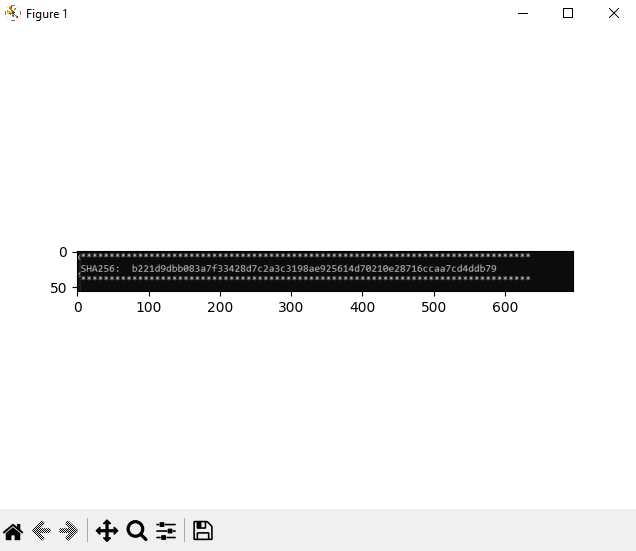

# skimage_python
Procesamiento de imágenes con skimage en Python

## Antes de usar

~~~~
pip install scikit-image
pip install matplotlib
~~~~

## Uso 

~~~~
python ski.py nombre_imagen.png
~~~~

### Resultado

